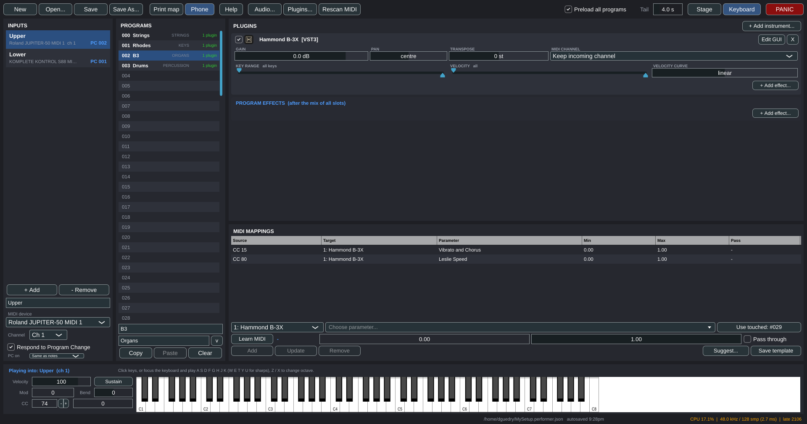

# Performer

**A live-performance plugin host for Linux.** Point your keyboards at it, build
a program for each sound in your set, and change sounds from the keyboard while
you play.

<p align="center">
  
</p>

Performer exists because the live hosts keyboard players rely on -- MainStage,
Gig Performer, Cantabile, Camelot -- have no Linux version. It hosts **VST3**,
**LV2** and **LADSPA** plugins natively, and Windows VST3s bridged with
[yabridge](https://github.com/robbert-vdh/yabridge) work like any other plugin.

- **A program per sound, 128 per keyboard**, selected by MIDI Program Change
  while you play. Upper and Lower manuals change independently.
- **Splits and layers** with per-slot key range, velocity range, velocity
  curve, transpose, gain and pan.
- **Insert effects** per instrument and per program.
- **MIDI learn** for any plugin parameter, with suggested mappings from
  parameter names and reusable per-plugin templates.
- **Every plugin in its own process.** A plugin that crashes or hangs takes
  only itself down; the rest of the rig plays on.
- **Built for low latency**: a native PipeWire/JACK client, 128-sample blocks
  by default, parallel plugin loading, and a late-block counter you can watch.
- **An on-screen keyboard** for building a set without a controller attached.

**[Read the user manual](docs/MANUAL.md)** for everyday use. The rest of this
file is for building from source and for how the program works inside.

Requires Linux, JUCE 8 (fetched as a submodule) and a C++17 compiler.
Licensed under the [GPL-3.0](LICENSE).

## Concepts

| Term | Meaning |
|------|---------|
| **Input** | A MIDI source: a MIDI device plus an optional channel filter. Each input has its own current program. Two inputs may share one device (e.g. channel 1 = Upper, channel 2 = Lower). |
| **Program** | One of 128 per input, selected by MIDI Program Change or by clicking. Holds plugin slots and MIDI mappings. |
| **Slot** | One instrument inside a program, with enable, gain, pan, transpose, key range, velocity range, velocity curve and MIDI-channel settings, plus its own insert-effect chain. Key and velocity ranges make splits and touch-switched layers; the curve matches a controller's feel to a library. |
| **Effect chain** | Ordered effects with bypass. Each slot has one (instrument → effects → gain); the program has one more applied to the sum of all slots. Effects receive the same MIDI as their slot. |
| **Mapping** | A CC / pitch-bend / aftertouch message → one parameter on any instrument or effect, scaled between min and max. Optionally also passed through to the plugin. |
| **Setup** | The whole document (inputs, programs, plugin states). Saved as `*.performer.json`. |

Program switching keeps the outgoing program rendering for a configurable
release tail so held notes fade naturally. With **Preload all programs** on,
every used program stays loaded and changes are instant (at the cost of RAM).

## Install

**[Download the latest release](https://github.com/dguedry/linux-performer/releases/latest)**
— a `.deb` for Debian/Ubuntu and an `.rpm` for Fedora, both x86-64. They install
`Performer` and `performer-plugin-host` into `/usr/bin`, plus a launcher entry
and the icon.

```sh
# Debian / Ubuntu
wget https://github.com/dguedry/linux-performer/releases/latest/download/performer_0.1.0_amd64.deb
sudo apt install ./performer_0.1.0_amd64.deb

# Fedora
wget https://github.com/dguedry/linux-performer/releases/latest/download/performer-0.1.0-1.x86_64.rpm
sudo dnf install ./performer-0.1.0-1.x86_64.rpm
```

Every push also builds both packages as workflow artifacts under
[Actions](https://github.com/dguedry/linux-performer/actions), if you want a
build from `main` rather than the last release.

For plugins you will also want `calf-plugins` (or any LV2/VST3 instruments),
`pipewire-jack` for the low-latency audio path, and
[yabridge](https://github.com/robbert-vdh/yabridge) for Windows plugins.

## Build

Requirements (Ubuntu 24.04 names): `build-essential cmake ninja-build
libasound2-dev libjack-jackd2-dev libx11-dev libxrandr-dev libxinerama-dev
libxcursor-dev libfreetype-dev libfontconfig1-dev libgl1-mesa-dev ladspa-sdk`.

```sh
git clone --recurse-submodules https://github.com/dguedry/linux-performer.git
cd linux-performer
# if you cloned without --recurse-submodules:
git submodule update --init --depth 1 external/JUCE

cmake -S . -B build -G Ninja -DCMAKE_BUILD_TYPE=Release
cmake --build build
./build/Performer_artefacts/Release/Performer            # opens the last setup
./build/Performer_artefacts/Release/Performer my.performer.json
cmake --install build --prefix ~/.local                  # optional: binaries, launcher entry and icon
```

## Using it

See the **[user manual](docs/MANUAL.md)**: inputs and keyboards, programs,
slots, splits and layers, effects, MIDI mappings, the on-screen keyboard, audio
settings and latency, live checklist, troubleshooting and the files Performer
uses.

The short version: **Audio...** to pick an output, **Plugins...** to scan for
plugins, select an input and give it a MIDI device, click a program, press
**+ Add instrument...**, then **Save As...**.

## Windows plugins via yabridge and nilinux

Windows VST3s bridged with yabridge appear as normal plugins. If the Wine prefix
is managed by [nilinux](https://github.com/dguedry/nilinux) (Native Access on
Linux), that tool requires DAWs to start yabridge with *its* wine: the host's
wine would run its own prefix update and corrupt the prefix. Performer follows
that convention for every helper it starts: `~/.local/bin` is put first on the
helper's `PATH` when nilinux's `wine` shim is there, and variables from
`~/.config/environment.d/*.conf` (`WINELOADER`, `WINEFSYNC`) are applied when
the session lacks them, so it does not matter whether Performer was started
from a terminal or a desktop launcher.

While Native Access installs or updates a product, its Windows plugin file is
replaced and the yabridge bundle briefly points at nothing. Performer reports
that as "yabridge link points to a missing file" instead of a blacklist; when
nilinux has finished (it runs `yabridgectl sync` after Native Access exits),
scan again and the plugin comes back.

## Process model

Every plugin runs in its own `performer-plugin-host` process. Performer talks to
each one over a shared-memory block (audio, MIDI and parameter changes, one
block at a time, with two semaphores) plus a socket for everything that is not
real-time: loading, state, parameter lists, editor windows and notifications.

- A plugin that crashes takes only its own process down. The slot goes silent,
  the UI marks it red, and its **Reload** button starts a fresh process with
  the saved state.
- A plugin that hangs (a stuck editor, a bridge waiting on Wine) can't freeze
  Performer: requests to it time out, and the audio thread waits for each
  process only until 85 % of the block period has passed. Late blocks are
  counted in the status bar as "late N".
- Plugin editors are windows of the host process, so they survive independently
  of Performer's UI. Instruments of one program render in parallel, one process
  per core; effect chains run in order.
- Plugin scanning also happens in helper processes (`performer-plugin-host --scan`),
  so a crashing plugin can't kill the scan.

The helper is looked for next to the `Performer` executable, then in the build
tree, then via `$PERFORMER_PLUGIN_HOST`.

## Layout of the code

- `Source/Model.*` – the document (`Setup → InputDef → ProgramDef → SlotDef / MappingDef`) and JSON persistence.
- `Source/PluginHost.*` – plugin formats, known-plugin list, out-of-process probing, mapping templates.
- `Source/PluginScanner.*` – app-owned background scan; `Source/PluginManagerComponent.h` – the Plugins window.
- `Source/MappingSuggestions.*` – per-plugin mapping templates and name-based CC suggestions.
- `Source/PluginIcons.*` – plugin icons: Windows PE icon resources, VST3 snapshots, generated badges.
- `Source/Engine.*` – audio/MIDI engine: device management, program loading and switching, MIDI routing, mappings, learn.
- `Source/RemotePlugin.*` – host-side proxy for one plugin process (spawn, control channel, real-time block exchange).
- `Source/Ipc/Protocol.*` – shared-memory layout and framing shared by both executables.
- `Source/PluginHostProcess/PluginHostMain.cpp` – the `performer-plugin-host` executable.
- `Source/MainComponent.*` – the UI (inputs, programs, slots, mappings panels).
- `Source/KeyboardPanel.h` – on-screen keyboard and test controllers.
- `Source/ParamPicker.h` – searchable parameter picker; `Source/AudioSettingsComponent.h` – the Audio window.
- `Source/LowLatency.*` – PipeWire JACK preload, quantum control, realtime checks.
- `Source/Main.cpp` – application entry.

## Tests

```sh
ctest --test-dir build
# Optionally exercise a specific VST3 (e.g. a yabridge-bridged plugin) through the engine:
PERFORMER_TEST_VST3="$HOME/.vst3/yabridge/Kontakt 8.vst3" ./build/EngineTest_artefacts/Release/EngineTest
```

All plugin buses are kept active and rendered into a full-size buffer; only the
main bus is mixed. Disabling aux buses makes JUCE pass null channel pointers,
which crashes plugins that write to them regardless (Kontakt via yabridge).

Settings live in `~/.config/Performer/`.

## Low latency (live use)

Performer is meant to be played live, so it goes for the smallest safe block:

* It loads PipeWire's JACK client library itself (`pipewire-jack`, package
  `pipewire-jack` on Debian/Ubuntu), so it does not need to be started with
  `pw-jack`, and it defaults to the **JACK** device type at 48 kHz. That makes
  Performer a direct node in the PipeWire graph; the ALSA type goes through
  PipeWire's ALSA emulation with its own buffering and resampling.
* **Audio...** has a *Live latency* section: the block size (quantum) to ask
  for (default 128 samples = 2.7 ms at 48 kHz; 64 if the machine is quiet) and
  *Take over the PipeWire clock while Performer runs*. With the takeover on,
  Performer forces the PipeWire graph to that quantum at start
  (`clock.force-quantum`) and restores the previous value when it quits, so
  the desktop's `min-quantum`/`default.clock.quantum` settings do not get in
  the way. The status bar shows the block size actually delivered and the
  resulting latency.
* **Another application can hold the clock.** Bitwig Studio, for example,
  forces `clock.force-quantum` to its own block size every few seconds while
  it runs; Performer then reports *clock held by another app* in the status
  bar. Close that application or set its block size to Performer's.
* **Realtime scheduling.** Small blocks only stay glitch-free when the audio
  thread can run at realtime priority. Check `ulimit -r`: if it prints 0, add
  yourself to the `pipewire` group (`sudo usermod -aG pipewire $USER`, then
  log out and back in) or otherwise grant `rtprio`/`memlock` in
  `/etc/security/limits.d/`. The Audio dialog reports whether realtime
  scheduling is available.
* Plugins load in parallel (four at a time by default; `parallelLoads` in
  `~/.config/Performer/Performer.settings` changes it), so *Preload all
  programs* fills a set quickly. Wine-bridged plugins load in parallel too
  (`parallelBridgedLoads`, default the same); two Kontakts starting together on
  a cold prefix both come up in the time one takes. If a machine stalls on
  concurrent Wine start-ups, `bridgedColdStartSolo=1` starts the first bridged
  plugin alone when no wineserver is running yet.
* Every plugin runs in its own process; a plugin that does not finish its
  block in time is silenced for that block and counted as *late* in the
  status bar, so one slow plugin cannot stall the whole rig.

## Releasing

Tag a version and push it; the *Packages* workflow builds the `.deb` and
`.rpm` with that version, runs the tests, creates the GitHub release with
generated notes and attaches both packages:

```sh
git tag v0.2.0 && git push origin v0.2.0
```

Local packages: `cmake --build build && (cd build && cpack -G DEB)` or `-G RPM`
on a machine with `rpm-build`.

## Contributing

Issues and pull requests are welcome. Please run the tests before opening a PR:

```sh
cmake --build build && ctest --test-dir build
```

Two things worth knowing before changing the engine: nothing may block the
audio thread (plugin calls go through the shared-memory block with a deadline),
and nothing may block the message thread on a plugin (loading happens on the
loader pool, and every plugin call from the UI has a timeout). `Tests/EngineTest.cpp`
runs real plugins through real helper processes and is the place to add
coverage.

## License

GPL-3.0-or-later. See [LICENSE](LICENSE).

JUCE is included as a submodule and carries [its own licence](https://github.com/juce-framework/JUCE/blob/master/LICENSE.md);
building this project under the GPL uses JUCE under the GPL.
