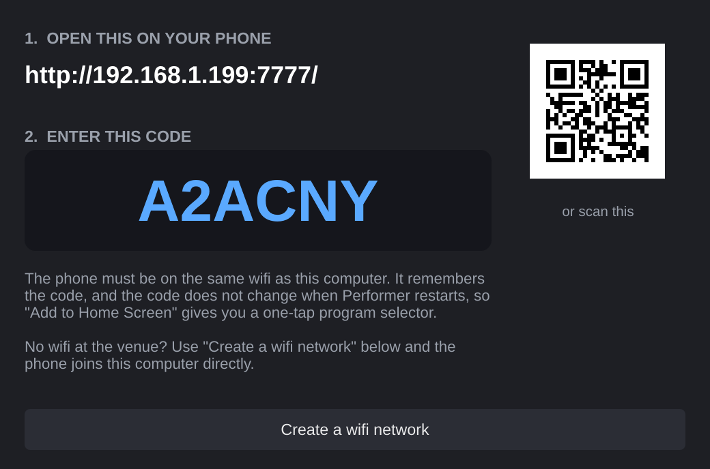
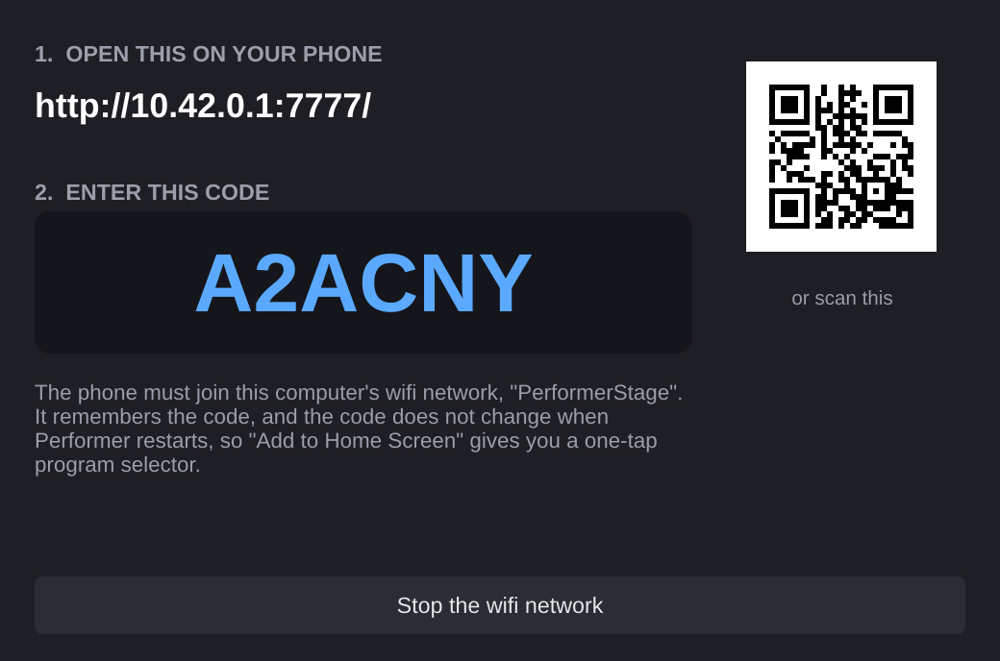

# Performer user manual

Performer is a live-performance plugin host for Linux. You point your keyboards
at it, build a program for each sound you need, and change sounds from the
keyboard while you play.

This manual covers everyday use. For building from source, the process model
and the code layout, see the [README](../README.md).

- [The idea in one minute](#the-idea-in-one-minute)
- [First run](#first-run)
- [The main window](#the-main-window)
- [Inputs: your keyboards](#inputs-your-keyboards)
- [Programs: your sounds](#programs-your-sounds)
- [Slots: instruments inside a program](#slots-instruments-inside-a-program)
- [Splits and layers](#splits-and-layers)
- [Effects](#effects)
- [MIDI mappings: knobs and pedals](#midi-mappings-knobs-and-pedals)
- [The on-screen keyboard](#the-on-screen-keyboard)
- [Audio settings and latency](#audio-settings-and-latency)
- [Saving, autosave and plugin state](#saving-autosave-and-plugin-state)
- [Playing live](#playing-live)
- [Windows plugins](#windows-plugins)
- [When something goes wrong](#when-something-goes-wrong)
- [Files Performer uses](#files-performer-uses)
- [Keyboard and mouse reference](#keyboard-and-mouse-reference)

## The idea in one minute

An **input** is a keyboard, or one MIDI channel of a keyboard. Each input holds
**128 programs**. A program is one sound of your set: it contains one or more
**slots**, each slot a plugin instrument with its own key range, velocity range,
transpose, gain, pan and effects.

While you play, a Program Change message from the keyboard selects the program
on that input. Upper and Lower change independently, so the left hand can stay
on a bass while the right hand moves through leads.

```
Keyboard ──> Input "Upper" (ch 1) ──> Program 007 "Solo" ──> Slot 1  Lead synth   C4-C8
                                                         └─> Slot 2  String pad   C4-C8, soft only
Keyboard ──> Input "Lower" (ch 2) ──> Program 002 "Bass" ──> Slot 1  Electric bass C0-B3
```

## First run

1. Start Performer. It opens with two empty inputs, **Upper** and **Lower**.
2. Open **Audio...** and choose your output. Performer defaults to the JACK
   device type at 48 kHz, which on a PipeWire system is the lowest-latency
   path. See [Audio settings and latency](#audio-settings-and-latency).
3. Open **Plugins...** and press **Scan VST3**, **Scan LV2** or **Scan LADSPA**.
   The scan runs in the background; you can close the window and keep working.
   Each plugin is tested in a separate process, so a plugin that crashes or
   hangs cannot take the scan down with it.
4. Select **Upper** on the left, choose its **MIDI device** and **Channel**.
5. Click program **000** in the middle list, name it, and press
   **+ Add instrument...**.
6. Play. Press **Save As...** when the set is worth keeping.

## The main window

| Area | What it does |
|---|---|
| **Toolbar** (top) | New / Open / Save / Save As, **Print map**, **Phone**, **Audio...**, **Plugins...**, **Rescan MIDI**, **Preload all programs**, release **Tail**, **Stage**, **Keyboard**, **PANIC**. |
| **Inputs** (left) | Your keyboards. Select one to edit its programs; its device, channel and Program Change setting are below the list. |
| **Programs** (middle) | The 128 programs of the selected input. Clicking one activates it. The name box, **Copy**, **Paste** and **Clear** are below. |
| **Plugins** (right, top) | The slots of the current program, each with its controls and effect chain, plus the program effect chain. |
| **MIDI mappings** (right, bottom) | Controller-to-parameter mappings for this program, with Learn and Suggest. |
| **Keyboard** (bottom, optional) | An on-screen keyboard for testing without a controller. |
| **Status bar** | Current file, CPU, sample rate, block size and latency, and warnings such as *late N* or *clock held by another app*. |

**PANIC** sends all-notes-off to every loaded plugin. Use it if a note hangs.

## Inputs: your keyboards

Each input has:

- **MIDI device** — any ALSA MIDI source. **Rescan MIDI** in the toolbar picks
  up a keyboard you plugged in after starting. If a saved device is missing,
  the list shows it as *(disconnected)* and reconnects when it returns.
- **Channel** — `Omni` accepts every channel, or pick one. Two inputs can share
  one physical keyboard by taking different channels, which is how a single
  controller drives both a left-hand and a right-hand part.
- **Respond to Program Change** — untick for an input whose sounds you want to
  change only by hand.
- **PC on** — which channel this input's Program Change messages arrive on.
  *Same as notes* is the default and is right for most keyboards. Some
  workstations send program changes on a fixed channel instead of the one they
  play on: a Roland Jupiter-50, for example, sends its registration changes on
  channel 16 while its keyboard parts play on 1, 3 and 4, so setting **PC on**
  to *Ch 16* makes the front-panel registration buttons select Performer
  programs while the notes still arrive on their own channel. *Any channel*
  accepts program changes from anywhere on that MIDI port, which is the setting
  to try when program changes are not getting through and you do not know what
  the keyboard sends.

**+ Add** and **- Remove** manage the list. There is no fixed limit of two; add
an input for a pedalboard, a second tier, or a drum pad.

## Programs: your sounds

The middle column is 128 program slots, numbered the way your keyboard's
Program Change messages are (000-127). A program in **bold with a plugin count**
has something in it.

- **Click** a program to make it current and edit it.
- **Name** it in the box below the list. Names appear in the list and make a
  set list readable from a distance.
- **Copy** / **Paste** duplicate a whole program, including plugin state, to
  another number. This is the fast way to make a variation of a sound.
- **Clear** empties a program.

**Preload all programs** (toolbar) loads every non-empty program at start and
keeps it loaded, so program changes are instant. Without it, a program loads
when you select it, which takes as long as the plugin needs (Kontakt is several
seconds). Preloading costs RAM: each plugin instance is a full copy.

**Tail** is how long the outgoing program keeps rendering after a program
change, so held notes and reverbs fade naturally instead of being cut off.
Four seconds is a good default.

## Slots: instruments inside a program

Each slot is one plugin instrument. The controls, left to right:

| Control | What it does |
|---|---|
| **Checkbox** | Enables the slot. Off is silent but stays loaded. |
| **Icon** | The plugin's own icon where it has one, otherwise a coloured badge with its initials. |
| **Name** | Plugin name and format. Red means it failed to load; hover for the reason. |
| **Edit GUI** | Opens the plugin's own editor in its own window. Shows **Reload** instead if the plugin died. |
| **X** | Removes the slot. |
| **GAIN** | Level of this slot, applied after its effects. Double-click for 0 dB. |
| **PAN** | Stereo position, `centre`, `L 40`, `R 25`. Double-click for centre. |
| **TRANSPOSE** | Shifts incoming notes in semitones; `+12 st` is an octave up. |
| **MIDI CHANNEL** | *Keep incoming channel*, or force one. Multi-timbral plugins such as Kontakt play the instrument assigned to that channel. |
| **KEY RANGE** | Two handles: the lowest and highest key that reach this slot. The caption spells the range out. |
| **VELOCITY** | Two handles: the softest and loudest note-on that reach this slot. |
| **VELOCITY CURVE** | Reshapes how hard your playing appears to the plugin, from `100 % softer` through `linear` to `+100 % louder`. |

**+ Add instrument...** adds a slot. The menu is grouped by manufacturer with
each plugin's icon.

## Splits and layers

Key range and velocity range are how a live rig is built.

**A split** — bass below middle C, piano above:

1. Add the bass. Set **KEY RANGE** from the lowest key to `B3`.
2. Add the piano. Set its **KEY RANGE** from `C4` up.

**A layer** — piano everywhere, strings on top:

1. Add both with the full key range. Both sound together.
2. Set the strings' **GAIN** lower so they sit under the piano.

**A velocity switch** — soft playing gives a pad, hard playing gives a horn:

1. Add the pad, set **VELOCITY** from `1` to `80`.
2. Add the horn, set **VELOCITY** from `81` to `127`.

Notes outside a slot's velocity range never reach it; note-offs always pass, so
nothing hangs when you change ranges while holding a chord.

**The velocity curve** fixes the mismatch between a controller's feel and a
library's programming. If a sound needs to be hammered to speak, move the curve
towards *louder*; if it blasts at the slightest touch, move it towards *softer*.
The extremes of your playing are untouched, only the feel in between changes.

## Effects

There are two places for effects:

- **Per slot** — **+ Add effect...** under a slot inserts an effect after that
  instrument. The order is instrument, then the effects top to bottom, then the
  slot's gain and pan.
- **Per program** — the **PROGRAM EFFECTS** section at the bottom processes the
  mix of every slot, which is where a shared reverb or a master compressor goes.

Each effect has a checkbox to bypass it, **^** and **v** to reorder, **Edit GUI**
and **X**. Effects receive the same MIDI as their slot, so tempo-synced and
MIDI-controlled effects work.

## MIDI mappings: knobs and pedals

A mapping sends a controller message to one plugin parameter. Mappings belong
to the program, so the same knob can do different things in different sounds.

**To make one:**

1. Choose the target plugin in the first box (it lists the slots and effects of
   this program).
2. Choose the parameter. The list is searchable: type part of the name and use
   the arrow keys. See the note on Kontakt below.
3. Press **Learn MIDI** and move the control on your keyboard. The source
   appears next to the button.
4. Set **Min** and **Max** if you want to limit the range. Reversing them
   (min above max) inverts the control.
5. Tick **Pass through** to *also* send the original message to the plugin.
6. Press **Add**.

**Use touched parameter** is often faster: open the plugin's GUI, move the knob
you care about, press the button, and Performer selects that parameter.

**Suggest...** proposes a whole set at once. If you saved a template for that
plugin it offers that; otherwise it matches parameter names against the General
MIDI Level 2 controllers (CC 74 cutoff, 71 resonance, 73/75/70/72 attack, decay,
sustain and release, 76/77 LFO rate and depth, 7 volume, 10 pan, 91 reverb,
93 chorus, 94 detune, 5 portamento, 12 drive, 13 delay mix). Untick anything
you do not want and press **Add selected**. **Save template** stores the current
mappings as that plugin's default for future programs.

**A note on VST3 and MIDI controllers.** VST3 plugins do not receive MIDI
controllers directly. Instead they publish one parameter per controller per MIDI
channel, and the host converts. Kontakt, for example, exposes 4145 parameters,
of which 2096 are these per-channel controller proxies. The parameter picker
therefore lists the controller parameters for the channel your input plays on
first, labelled `(ch 1)` with the controller number, then the plugin's own
parameters, and puts the other channels behind a toggle. To map a knob to a
Kontakt instrument's own control, assign a host-automation slot in Kontakt
(Automation → Host Automation, drag a slot onto the knob) and map to that
`#NNN` parameter, or use *Use touched parameter*.

## Reading the stage display

**Stage** in the toolbar puts a large readout at the top of the window: for each
input, the program number and the program's name, big enough to read from a
stand while you play. When you pick programs by number on the keyboard, this is
your confirmation that the right sound loaded. A program still loading is marked
*...loading*, which explains a keyboard that is briefly silent, and an empty
program is greyed.

## Selecting programs from a phone or tablet

**Phone** in the toolbar starts a small web app on your network. It lists each
input with its current program in large type and every program you have set up;
tap one to switch to it. There is a PANIC button too. Nothing is installed on
the phone: it is a web page.



There are two ways in, and the fast one is the square code. Point the phone's
camera at it and it opens Performer directly, with no address to read off a
screen. **Print map** puts the same code on the printed sheet, so a page taped
to the keyboard is also the way in.

To type it instead, enter the address once, then the six-character code. The
phone remembers the code, and it does not change when Performer restarts, so a
home-screen shortcut keeps working. It is case-insensitive and avoids characters
that misread, so `0`/`O` and `1`/`I` never appear.

Phone control stays on across restarts. If it was on when you quit, Performer
starts the web app again at launch, so a phone on a stand keeps working without
anyone going back to the laptop. Turning it off is remembered the same way.

A program picked from the phone is a real change to the setup, exactly like
picking one on the laptop. It is written to the setup file you have open, within
a couple of seconds rather than waiting for the next periodic save, because
someone who changes a program from a music stand has no way to reach Ctrl+S.

Anyone on your network who has the code can change your sounds, which is the
right level of care for a stage tool and no more: do not expect it to be safe on
an untrusted network.

### If the phone cannot connect

The most common cause is a firewall on the computer, not anything wrong with
Performer or the phone. The symptom is confusing, because the desktop can open
the address itself perfectly well while the phone just times out: traffic from
the same machine never passes the firewall, so only the phone is blocked.

Performer warns about this when it can detect it. To allow the port from your
own networks only, and not from the internet:

```
sudo ufw allow from 192.168.0.0/16 to any port 7777 proto tcp
sudo ufw allow from 10.0.0.0/8 to any port 7777 proto tcp
sudo ufw allow from 172.16.0.0/12 to any port 7777 proto tcp
```

Those three ranges are the private address blocks, so the rule covers your home
wifi, a venue's network and Performer's own hotspot, while refusing anything
from outside. If you use a different firewall the principle is the same: open
TCP 7777 for private networks.

### Adding it to the home screen

On Android, Chrome offers to install the page once it has loaded, and you can
also use **Add to Home Screen** from its menu. It then opens fullscreen with its
own icon, like an app.

On an iPhone or iPad, use **Share** then **Add to Home Screen** in Safari. iOS
does not offer an automatic prompt for this.

If no automatic prompt appears on Android, the menu item still works. Browsers
only volunteer the prompt on an address they consider secure, which in practice
means `https`, and Performer serves plain `http` on your own network. That is a
deliberate trade: a certificate for a private address is not something a stage
tool should be demanding of you. The manual route works regardless, and the
installed shortcut behaves identically.

### When the venue has no usable wifi

Guest networks often stop devices from seeing each other, and plenty of stages
have no wifi at all. **Create a wifi network** in the Phone dialog makes this
computer serve its own network instead, so the phone joins the laptop directly
and needs nothing from the venue.



The first time, Performer asks which wifi adapter to use and remembers the
answer, along with the network name and password. There is nothing to set up on
the phone: it gets an address automatically when it joins, exactly like joining
any other wifi, and it still has internet through whatever this computer is
connected to.

One radio usually cannot be a client and an access point at once, so if this
computer has a single wifi adapter it will leave its current network while the
hotspot runs. That is normally what you want on stage. If you would rather keep
both, a cheap USB wifi adapter gives you a second radio, and Performer prefers
whichever adapter is free. The adapter list marks which is which, so the choice
is not a guess.

Pick a network name and password you are happy to reuse, because the phone then
reconnects on its own at the next gig. Use **Stop the wifi network** in the same
dialog to return this computer to its normal network.

## Printing a program map

**Print map** writes a sheet of which program number plays which sound, and
opens it in your browser; print it from there. Only programs you have filled in
are listed, with each program's number, its name and the instruments in it,
grouped by input with the MIDI device and channel. Tape it to the keyboard and
you never have to remember that the Rhodes is 001.

If phone control is running when you print, the sheet also carries the square
code from the Phone dialog, so the page on the keyboard doubles as the way onto
the phone selector.


## The on-screen keyboard

The **Keyboard** button opens a keyboard at the bottom of the window with
velocity, sustain, mod wheel, pitch bend and a free CC number and value. It
plays into the selected input on that input's channel, through exactly the same
path as a real keyboard, so it works for auditioning sounds, checking splits and
doing MIDI learn without a controller connected.

Click the keys with the mouse, or focus the keyboard and use the computer
keyboard: `A S D F G H J K` for white keys, `W E T Y U` for sharps, `Z` and `X`
to shift octave.

## Audio settings and latency

**Audio...** has two parts. The top is Performer's own **Live latency** section:

- **PipeWire quantum** — the block size to ask for. 128 samples is 2.7 ms at
  48 kHz and a good live default; 64 if the machine is quiet and has realtime
  scheduling.
- **Take over the PipeWire clock while Performer runs** — forces the graph to
  that block size at start and restores the previous value on quit.
- A status line shows the device, the block size actually delivered, the
  resulting latency, whether realtime scheduling is available, and warnings.

Below that is the standard device selector: device type, output, sample rate
and buffer size.

**For the lowest latency:**

- Use the **JACK** device type. On PipeWire this makes Performer a native node
  in the graph, with no resampling and no extra buffering. The ALSA type goes
  through PipeWire's ALSA emulation.
- Give yourself **realtime scheduling**. Run `ulimit -r`; if it prints 0, add
  yourself to the `pipewire` group with `sudo usermod -aG pipewire $USER` and
  log out and back in. Small blocks without realtime priority cause dropouts.
- **Close other audio applications.** A DAW such as Bitwig forces the PipeWire
  clock to its own block size every few seconds; Performer then shows *clock
  held by another app* in the status bar and cannot get its own block size.

*late N* in the status bar counts blocks where a plugin did not answer in time.
A few during loading are normal. A number that climbs while you play means the
block size is too small for the plugins in that program.

## Saving, autosave and plugin state

A setup is one `.performer.json` file holding every input, program, plugin and
mapping, including each plugin's own state.

- **Save** / **Save As...** write the file. The last file reopens next start.
- Plugin state is captured whenever a program is unloaded and whenever you save,
  so tweaks made inside a plugin GUI persist.
- Performer autosaves about once a minute to
  `~/.config/Performer/autosave.performer.json` and again on quit. If that file
  is newer than the setup you open, the status bar tells you.

A setup file is plain JSON and safe to keep in version control.

## Playing live

A short checklist:

- Turn on **Preload all programs** and give Performer time to load everything
  before the first song. The status bar stops showing loading activity when it
  is done.
- Check that the status bar shows the block size you expect and no *late*
  count.
- Set the **Tail** long enough that program changes do not cut your release.
- Learn where **PANIC** is.
- Keep the set on one input per manual, with program numbers matching the
  patch numbers on your keyboard, so you never touch the computer.

## Windows plugins

Windows VST3 plugins bridged with [yabridge](https://github.com/robbert-vdh/yabridge)
appear as ordinary VST3s. Scan the folder yabridge puts them in, usually
`~/.vst3/yabridge`.

If your Wine prefix is managed by [nilinux](https://github.com/dguedry/nilinux)
(Native Access on Linux), Performer follows its convention automatically: it
puts `~/.local/bin` first on the helper's PATH when the nilinux `wine` shim is
there, and applies `WINELOADER` and `WINEFSYNC` from
`~/.config/environment.d/*.conf`. This matters because the wrong Wine version
would try to update the prefix and corrupt it.

While Native Access installs or updates a product, the bridged plugin file is
briefly missing. Performer reports *yabridge link points to a missing file*
rather than blacklisting the plugin; scan again once the install has finished.

## When something goes wrong

| What you see | What it means | What to do |
|---|---|---|
| A slot is red, with **Reload** instead of Edit GUI | That plugin's process died. Only that plugin is affected. | Press **Reload**; it restarts with the saved state. |
| A plugin shows *Deactivated* in the Plugins window | It hung or crashed twice while being scanned. | Select it and press **Remove selected** to give it another chance. |
| *late N* climbing while playing | Plugins are missing the block deadline. | Raise the block size in **Audio...**, or check realtime scheduling. |
| *clock held by another app* | Another audio application forces the PipeWire block size. | Close it, or set its block size to match. |
| No sound, plugin loaded | Slot disabled, key or velocity range excludes what you play, gain at minimum, or wrong MIDI channel. | Check the slot's controls; the on-screen keyboard rules out the controller. |
| A note hangs | A plugin missed a note-off. | Press **PANIC**. |
| The parameter list seems endless | A VST3 with thousands of per-channel controller parameters. | Type in the search box; see the mapping section above. |
| An empty plugin editor that will not respond | An ARA-only plugin outside an ARA host. | Use the plugin's non-ARA version. |

## Files Performer uses

| Path | What it is |
|---|---|
| `~/.config/Performer/Performer.settings` | Window, audio device, scan folders, known plugins, tuning options. |
| `~/.config/Performer/autosave.performer.json` | The rolling autosave. |
| `~/.config/Performer/mapping-templates.json` | Your saved per-plugin mapping templates. |
| `~/.config/Performer/icons/` | Cached plugin icons. |
| `~/.config/Performer/RecentlyCrashedPluginsList` | Plugins that crashed while scanning. |
| your `*.performer.json` | Your set. Keep it wherever you like. |

Advanced options can be set in `Performer.settings`: `parallelLoads` (how many
plugins load at once, default 4), `parallelBridgedLoads`, `bridgedColdStartSolo`,
`pipewireQuantum` and `pipewireTakeover`.

## Keyboard and mouse reference

| Action | Where |
|---|---|
| Double-click a gain, pan, transpose or curve bar | Resets it to its neutral value. |
| Drag a range slider's handles | Sets the low and high ends of a key or velocity range. |
| Type in the parameter picker | Filters thousands of parameters; arrows and Page keys move, Return picks, Escape cancels. |
| `A S D F G H J K` / `W E T Y U` | White and black keys on the on-screen keyboard. |
| `Z` / `X` | Shift the on-screen keyboard down or up an octave. |
| Escape | Closes a dialog. |
